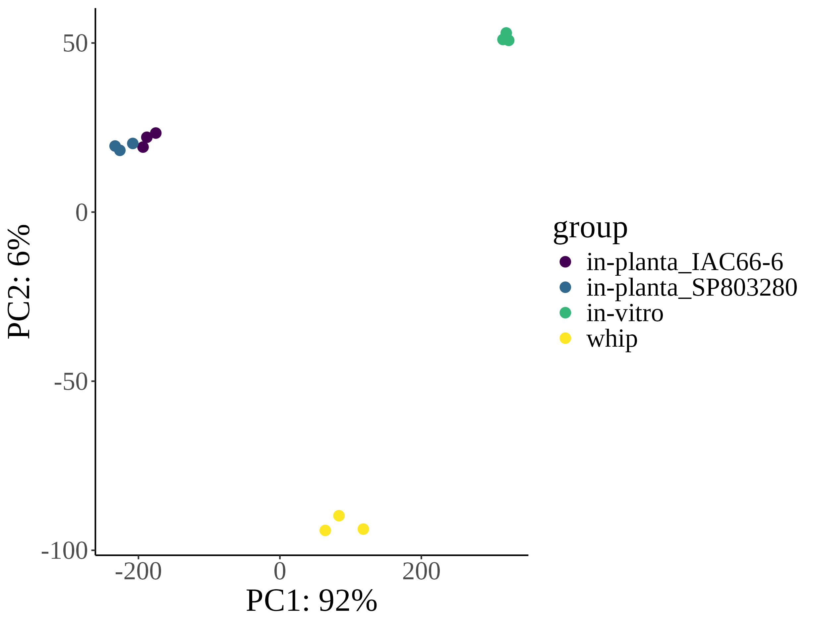
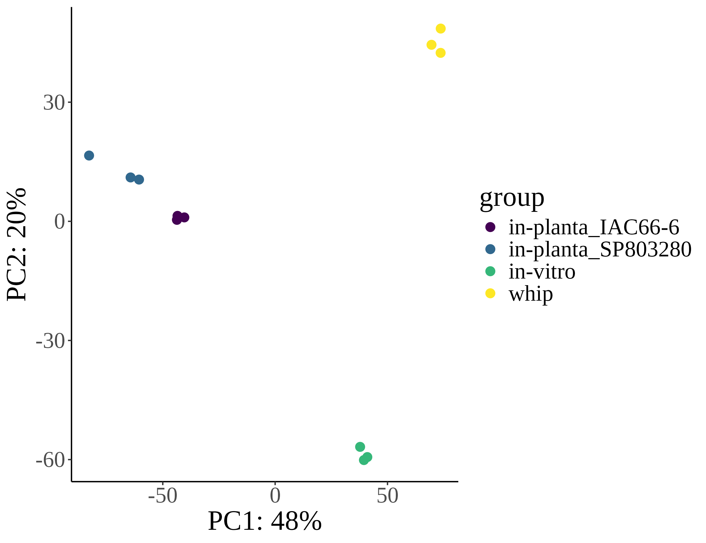
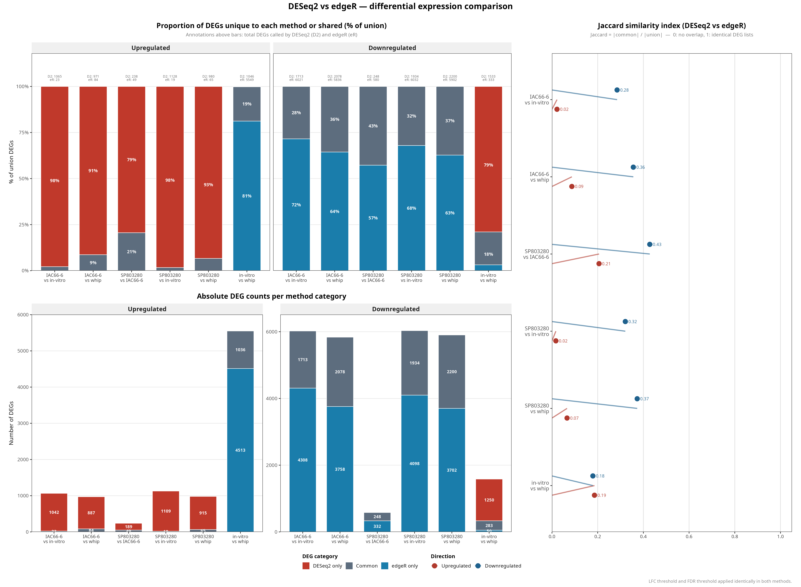
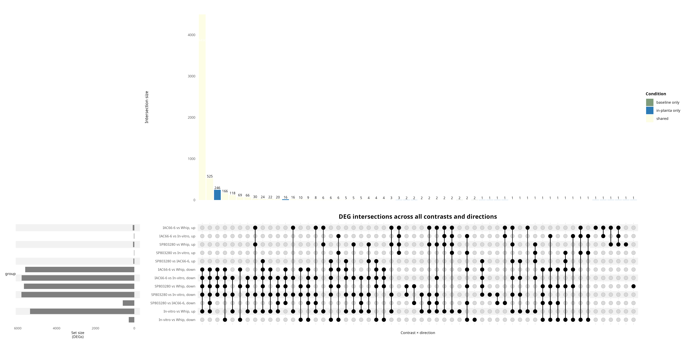
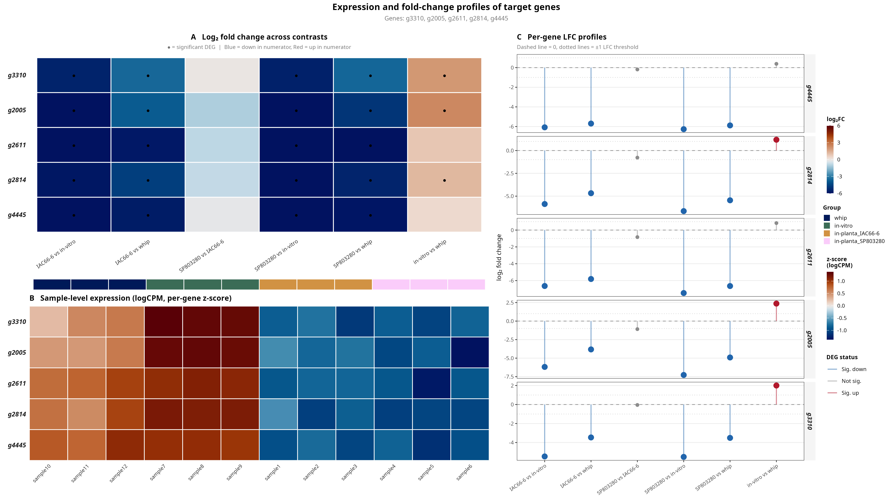

# RNAseq analysis of *Fusarium verticillioides*

## Overview

This repository accompanies the study of the molecular mechanisms of infection of smut disease in sugarcane

## RNAseq Workflow Description

| sample | fastq_1 | fastq_2 | strandedness | seq_platform | condition | trait | replicate | group |
|---|---|---|---|---|---|---|---|---|
| sample1 | /home/joao/RNAseq_RNAi/raw_data/in_planta/SSC04_IAC66-6_Rep1_1.fastq | /home/joao/RNAseq_RNAi/raw_data/in_planta/SSC04_IAC66-6_Rep1_2.fastq | auto | ILLUMINA | in_planta | susceptible | 1 | in-planta_IAC66-6 |
| sample2 | /home/joao/RNAseq_RNAi/raw_data/in_planta/SSC04_IAC66-6_Rep2_1.fastq | /home/joao/RNAseq_RNAi/raw_data/in_planta/SSC04_IAC66-6_Rep2_2.fastq | auto | ILLUMINA | in_planta | susceptible | 2 | in-planta_IAC66-6 |
| sample3 | /home/joao/RNAseq_RNAi/raw_data/in_planta/SSC04_IAC66-6_Rep3_1.fastq | /home/joao/RNAseq_RNAi/raw_data/in_planta/SSC04_IAC66-6_Rep3_2.fastq | auto | ILLUMINA | in_planta | susceptible | 3 | in-planta_IAC66-6 |
| sample4 | /home/joao/RNAseq_RNAi/raw_data/in_planta/SSC04_SP803280_Rep1_1.fastq | /home/joao/RNAseq_RNAi/raw_data/in_planta/SSC04_SP803280_Rep1_2.fastq | auto | ILLUMINA | in_planta | resistant | 1 | in-planta_SP803280 |
| sample5 | /home/joao/RNAseq_RNAi/raw_data/in_planta/SSC04_SP803280_Rep2_1.fastq | /home/joao/RNAseq_RNAi/raw_data/in_planta/SSC04_SP803280_Rep2_2.fastq | auto | ILLUMINA | in_planta | resistant | 2 | in-planta_SP803280 |
| sample6 | /home/joao/RNAseq_RNAi/raw_data/in_planta/SSC04_SP803280_Rep3_1.fastq | /home/joao/RNAseq_RNAi/raw_data/in_planta/SSC04_SP803280_Rep3_2.fastq | auto | ILLUMINA | in_planta | resistant | 3 | in-planta_SP803280 |
| sample7 | /home/joao/RNAseq_RNAi/raw_data/in_vitro/SSC04_InVitro_Rep1_1.fastq | /home/joao/RNAseq_RNAi/raw_data/in_vitro/SSC04_InVitro_Rep1_2.fastq | auto | ILLUMINA | in_vitro | NA | 1 | in-vitro |
| sample8 | /home/joao/RNAseq_RNAi/raw_data/in_vitro/SSC04_InVitro_Rep2_1.fastq | /home/joao/RNAseq_RNAi/raw_data/in_vitro/SSC04_InVitro_Rep2_2.fastq | auto | ILLUMINA | in_vitro | NA | 2 | in-vitro |
| sample9 | /home/joao/RNAseq_RNAi/raw_data/in_vitro/SSC04_InVitro_Rep3_1.fastq | /home/joao/RNAseq_RNAi/raw_data/in_vitro/SSC04_InVitro_Rep3_2.fastq | auto | ILLUMINA | in_vitro | NA | 3 | in-vitro |
| sample10 | /home/joao/RNAseq_RNAi/raw_data/whip/Whip_RB_R1_C13_S22_L002_R1_001.fastq | /home/joao/RNAseq_RNAi/raw_data/whip/Whip_RB_R1_C13_S22_L002_R2_001.fastq | auto | ILLUMINA | whip | susceptible | 1 | whip |
| sample11 | /home/joao/RNAseq_RNAi/raw_data/whip/Whip_RB_R2_C14_S23_L002_R1_001.fastq | /home/joao/RNAseq_RNAi/raw_data/whip/Whip_RB_R2_C14_S23_L002_R2_001.fastq | auto | ILLUMINA | whip | susceptible | 2 | whip |
| sample12 | /home/joao/RNAseq_RNAi/raw_data/whip/Whip_RB_R3_C15_S24_L002_R1_001.fastq | /home/joao/RNAseq_RNAi/raw_data/whip/Whip_RB_R3_C15_S24_L002_R2_001.fastq | auto | ILLUMINA | whip | susceptible | 3 | whip |

### 1. **References**

- `Genome Assembly`: /home/joao/RNAseq_RNAi/genome/files_bianca/fix_pedro.fasta (SSC04-MAT1)
- `Proteins`: /dados01/jorge/bianca/references/PEDRO_genome/fix_pedro_proteins.fasta
- `GTF`: /home/joao/RNAseq_RNAi/genome/files_bianca/SSC04-MAT1.gtf

### 2. **Protein Annotation**

We used `emapper-2.1.3` from `EggNOG v5.0` to get KEGG orthology annotations for the proteins of the genome based on orthology relationships. 
- Code: `eggnog/run_eggnog.sh`
- Results: /dados01/jorge/bianca/references/PEDRO_genome/annotation/proteins.emapper.emapper.annotations`

### 3. **RNAseq processing**

We used a `Nextflow v25.04.7` pipeline `rnaseq (v3.12.0)` from nf-core (https://nf-co.re/rnaseq/3.12.0) to preprocces, align and quantify RNAseq data

We used the default method from `rnaseq (v3.12.0)` which uses `STAR` aligner and `Salmon` to quantify transcript abundance.

Full report of preprocess and aligment can be found in 
/home/joao/RNAseq_RNAi/rnaseq/test1/multiqc/star_salmon/multiqc_report.html

generated reads: 73.3M (73346735)
aligned reads: 48.1M

### 4. **Exploratory Analysis**

Due to the imbalanced number of reads in the samples (see /home/joao/RNAseq_RNAi/rnaseq/test1/multiqc/star_salmon/multiqc_report.html) we tested DESeq2 and EdgeR algorthims

for deseq2 we used vst (variance stabilization transformation) and to filter low count genes:
min_count <- 1
min_samples <- 5

lfc_threshold <- 1
padj_threshold <- 0.05

in edgeR we used: "TMM", filterByExpr() taht scales the count threshold to effective library sizes, which is critical, and:
min_count        <- 3   # minimum count (not CPM) in the smallest group
min_total_count  <- 12   # minimum total count across all samples
large_n          <- 3   # sample-size threshold used internally by filterByExpr

lfc_threshold  <- 1     # |log2 fold change| threshold
padj_threshold <- 0.05  # FDR (BH) threshold

- Principal component analysis: We load the quantification data produced by Salmon into DESeq2 and EdgeR and used the transformed counts.

    - PCA EdgeR

  Initial genes: 6659
  Genes after filtering: 6189
  Genes removed:         470 (7.1%)

   - PCA DESeq2

Initial genes: 6659
  Genes after filtering: 6256
  Genes removed: 403 (6.1%)

### 5. **Differential Expression Analysis (DEA)**

We conducted a differential expression analysis (DEA) on this contrasts filtering for p-adj (FDR) < 0.05 and |log 2 fold change| > 1

in_planta_IAC66_6_vs_in_vitro
in_planta_IAC66_6_vs_whip
in_planta_SP803280_vs_in_planta_IAC66_6
in_planta_SP803280_vs_in_vitro
in_planta_SP803280_vs_whip
in_vitro_vs_whip

for example downregulated genes in in_planta_IAC66_6_vs_in_vitro mean genes differentially less expressed in in_planta_IAC66_6 than in in_vitro and consecuentely upregulated genes means more expressed in in_planta_IAC66_6 than in in_vitro

   - DESeq2 vs EdgeR

- results DESeq2: /home/joao/RNAseq_RNAi/rnaseq/test1/star_salmon/deseq2_qc
- results EdgeR: /home/joao/RNAseq_RNAi/rnaseq/test1/star_salmon/edger_qc
- results Comparison: /home/joao/RNAseq_RNAi/rnaseq/test1/star_salmon/method_comparison

EdgeR is recommended in cases of inbalanced libraries (as this case), EdgeR groups better the samples in the PCA and DESeq2 clearly shows a bias in upregulated genes.

WE CHOOSE EdgeR RESULTS!!!

- upset EdgeR

| Contrast | Description | Upregulated | Downregulated | Total_DEGs |
|---|---|---|---|---|
| in_vitro_vs_whip | in-vitro vs whip | 5549 | 333 | 5882 |
| in_planta_IAC66_6_vs_whip | in-planta_IAC66-6 vs whip | 84 | 5836 | 5920 |
| in_planta_IAC66_6_vs_in_vitro | in-planta_IAC66-6 vs in-vitro | 23 | 6021 | 6044 |
| in_planta_SP803280_vs_whip | in-planta_SP803280 vs whip | 65 | 5902 | 5967 |
| in_planta_SP803280_vs_in_vitro | in-planta_SP803280 vs in-vitro | 19 | 6032 | 6051 |
| in_planta_SP803280_vs_in_planta_IAC66_6 | in-planta_SP803280 vs in-planta_IAC66-6 | 49 | 580 | 629 |

### 6. **Functional Enrichment Analysis**

To get insights about the function and the processes that are represented by the sets of up-regulated and down-regulated genes we carried out over representation analysis (ORA) for gene ontology terms (GO)

- GO: We used topGO R package (v2.58.0), p-value < 0.05 and corrected for multiple testing using BH (FDR) procedure

See erichment results for all contrastas in the server

/home/joao/RNAseq_RNAi/rnaseq/test1/star_salmon/edger_qc/in_planta_IAC66_6_vs_in_vitro/GO_enrichment
/home/joao/RNAseq_RNAi/rnaseq/test1/star_salmon/edger_qc/in_planta_IAC66_6_vs_whip/GO_enrichment
/home/joao/RNAseq_RNAi/rnaseq/test1/star_salmon/edger_qc/in_planta_SP803280_vs_in_planta_IAC66_6/GO_enrichment
/home/joao/RNAseq_RNAi/rnaseq/test1/star_salmon/edger_qc/in_planta_SP803280_vs_in_vitro/GO_enrichment
/home/joao/RNAseq_RNAi/rnaseq/test1/star_salmon/edger_qc/in_planta_SP803280_vs_whip/GO_enrichment
/home/joao/RNAseq_RNAi/rnaseq/test1/star_salmon/edger_qc/in_vitro_vs_whip/GO_enrichment

### 7. **Gene Profiling**

We investigated the expression patterns of this genes g3310, g2005, g2611, g2814, g4445 across samples and contrasts

- Gene profiling

see complete results in the server in: 

/home/joao/RNAseq_RNAi/rnaseq/test1/star_salmon/edger_qc/gene_profiles

